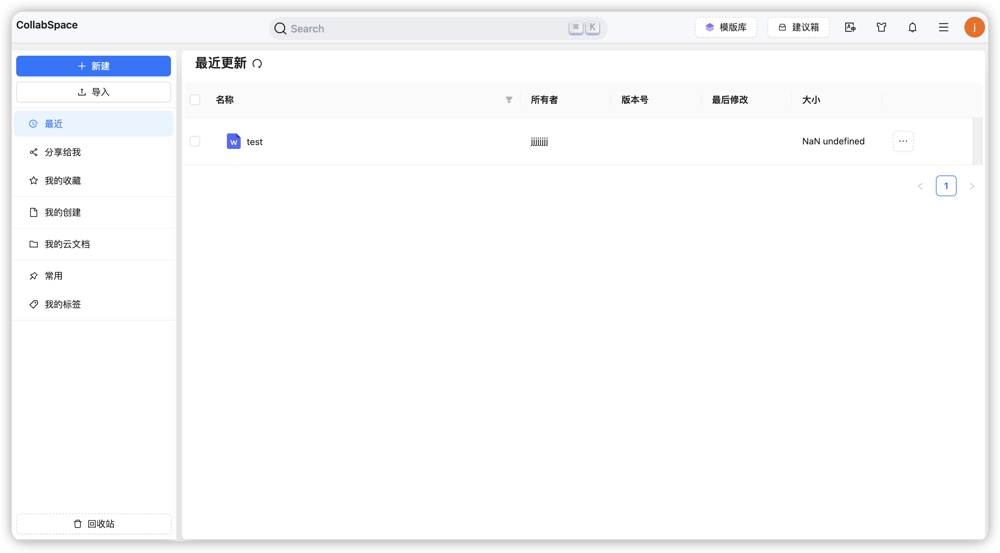
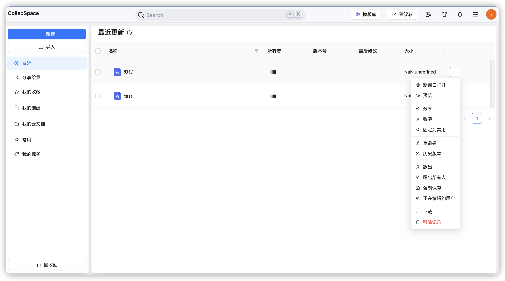

<p  align="center">

</p>

<h2 align="center">简约 · 实用 · 前沿 · 创新</h2>

## 概要

CollabSpace 是一个私有化在线文档协作空间，提供了在线文档查看，编辑，以及协同。

## 技术栈

1. 语言：[React](https://zh-hans.react.dev/)
2. [Typescript](https://www.typescriptlang.org/)
3. UI 框架：[Antd](https://ant.design/)
4. [nextjs](https://nextjs.org/)
5. css 框架：[tailwindcss](https://tailwindcss.com/)
6. 请求框架：[axis](https://axios-http.com/)

## 安装

```bash
npm install
```

## 运行

```bash
npm run dev
```

## 打包

```bash
npm run build
```

## 界面预览

<table>
    <tr>
        <td></td>
        <td></td>
        <td></td>
    </tr>
    <tr>
        <td></td>
    </tr>
</table>
